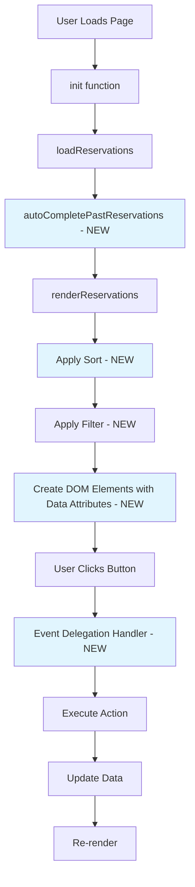

# Reservations App Improvement Plan

## Overview

This plan outlines improvements to the Love Shack reservations application, focusing on removing inline JavaScript, adding proper data attributes, implementing sorting, auto-completing past reservations, and adding a new menu interface.

## Current Issues Identified

### 1. Inline JavaScript (Bad Practice)

Found inline `onclick` handlers in [`reservations/js/app.js:688-712`](reservations/js/app.js:688):

```javascript
onclick = "updateStatusFromSheet('res_1773343480000_pablo', 'completed')";
onclick = "printReservation()";
onclick = "editReservation('${reservation.id}')";
onclick = "deleteReservationPrompt('${reservation.id}')";
```

### 2. Missing Data Attributes

No `data-status`, `data-button-name`, `data-res`, `data-scope`, or `aria-label` attributes on buttons or reservation items.

### 3. Needs Sorting Functionality

Reservations are sorted by date but need user-controlled sorting.

### 4. Needs Auto-Complete for Past Reservations

Past reservations need to be automatically marked as completed.

### 5. Needs Visual Distinction for Past Reservations

Past reservations should appear in grayscale.

### 6. Needs Menu Below Header

Need to add a menu below `class="app-header"` with sorting and filtering controls.

---

## Implementation Plan

### Phase 1: Add Data Attributes to Reservation Items

**Files to modify:** [`reservations/js/app.js`](reservations/js/app.js)

**In [`createReservationItem()`](reservations/js/app.js:272):**

- Add `data-status="${reservation.status || 'pending'}"` to the reservation item
- Add `data-res="${reservation.id}"` to the reservation item
- Add `data-scope="reservation-item"` to identify the element type

**In [`renderSideSheetDetails()`](reservations/js/app.js:685):**

- Replace inline `onclick` with proper data attributes:

  ```javascript
  data-button-name="status-pending"
  data-res="${reservation.id}"
  data-scope="status-toggle"
  aria-label="Mark as pending"

  data-button-name="status-completed"
  data-res="${reservation.id}"
  data-scope="status-toggle"
  aria-label="Mark as completed"

  data-button-name="print"
  data-scope="action-button"
  aria-label="Print reservation"

  data-button-name="edit"
  data-res="${reservation.id}"
  data-scope="action-button"
  aria-label="Edit reservation"

  data-button-name="delete"
  data-res="${reservation.id}"
  data-scope="action-button"
  aria-label="Delete reservation"
  ```

### Phase 2: Implement Event Delegation

**Files to modify:** [`reservations/js/app.js`](reservations/js/app.js)

**Add new event delegation setup in [`setupEventListeners()`](reservations/js/app.js:125):**

```javascript
// Event delegation for reservation actions
document.addEventListener("click", handleReservationAction);
```

**Add new handler function:**

```javascript
function handleReservationAction(event) {
  const target = event.target.closest("[data-button-name]");
  if (!target) return;

  const buttonName = target.dataset.buttonName;
  const reservationId = target.dataset.res;
  const scope = target.dataset.scope;

  switch (buttonName) {
    case "status-pending":
      updateStatusFromSheet(reservationId, "pending");
      break;
    case "status-completed":
      updateStatusFromSheet(reservationId, "completed");
      break;
    case "print":
      printReservation();
      break;
    case "edit":
      editReservation(reservationId);
      break;
    case "delete":
      deleteReservationPrompt(reservationId);
      break;
  }
}
```

### Phase 3: Implement Sorting Functionality

**Files to modify:** [`reservations/js/app.js`](reservations/js/app.js)

**Add state variables:**

```javascript
let currentSortBy = "date-desc"; // date-asc, date-desc, name-asc, name-desc, price-asc, price-desc
```

**Modify [`renderReservations()`](reservations/js/app.js:213):**

- Add sorting logic based on `currentSortBy`
- Sort options:
  - `date-asc`: Date ascending (oldest first)
  - `date-desc`: Date descending (newest first)
  - `name-asc`: Name A-Z
  - `name-desc`: Name Z-A
  - `price-asc`: Price low to high
  - `price-desc`: Price high to low

### Phase 4: Auto-Complete Past Reservations

**Files to modify:** [`reservations/js/app.js`](reservations/js/app.js)

**Add function in [`loadReservations()`](reservations/js/app.js:103):**

```javascript
function autoCompletePastReservations() {
  const today = new Date();
  today.setHours(0, 0, 0, 0);

  let hasChanges = false;

  reservations = reservations.map((reservation) => {
    const reservationDate = parseLocalDate(reservation.reservationDate);
    reservationDate.setHours(23, 59, 59, 999); // End of day

    if (
      reservationDate < today &&
      reservation.status !== "completed" &&
      reservation.status !== "cancelled"
    ) {
      hasChanges = true;
      return { ...reservation, status: "completed" };
    }
    return reservation;
  });

  if (hasChanges) {
    saveReservations(reservations);
  }
}
```

**Call in [`init()`](reservations/js/app.js:62):**

```javascript
autoCompletePastReservations();
```

### Phase 5: Grayscale Styling for Past Reservations

**Files to modify:** [`reservations/css/styles.css`](reservations/css/styles.css)

**Add CSS:**

```css
/* Past reservations - grayscale */
.reservation-item.is-past {
  filter: grayscale(100%);
  opacity: 0.7;
}

.reservation-item.is-past:hover {
  filter: grayscale(50%);
  opacity: 1;
}
```

**Modify [`createReservationItem()`](reservations/js/app.js:272) to add class:**

```javascript
// Check if reservation is past
const today = new Date();
today.setHours(0, 0, 0, 0);
const reservationDate = parseLocalDate(reservation.reservationDate);
reservationDate.setHours(0, 0, 0, 0);
const isPast = reservationDate < today;

if (isPast) {
  item.classList.add("is-past");
}
```

### Phase 6: Add Menu Below Header

**Files to modify:** [`reservations/index.html`](reservations/index.html)

**Add new menu HTML after `<header class="app-header">`:**

```html
<!-- Filter & Sort Menu -->
<div class="app-menu">
  <div class="menu-section">
    <label class="menu-label">Sort:</label>
    <select id="sortSelect" class="menu-select" aria-label="Sort reservations">
      <option value="date-desc">Date (Newest First)</option>
      <option value="date-asc">Date (Oldest First)</option>
      <option value="name-asc">Name (A-Z)</option>
      <option value="name-desc">Name (Z-A)</option>
      <option value="price-desc">Price (High to Low)</option>
      <option value="price-asc">Price (Low to High)</option>
    </select>
  </div>

  <div class="menu-section">
    <label class="menu-toggle">
      <input type="checkbox" id="hideCompletedToggle" />
      <span class="toggle-slider"></span>
      <span class="toggle-label">Hide Completed</span>
    </label>
  </div>

  <div class="menu-section menu-stats">
    <span id="visibleCount">0</span> /
    <span id="totalCount">0</span> reservations
  </div>
</div>
```

### Phase 7: Add Menu CSS

**Files to modify:** [`reservations/css/styles.css`](reservations/css/styles.css)

**Add menu styles:**

```css
/* App Menu */
.app-menu {
  display: flex;
  align-items: center;
  gap: 24px;
  padding: 16px 24px;
  background: var(--bg-card);
  border-bottom: 1px solid var(--border-color);
  flex-wrap: wrap;
}

.menu-section {
  display: flex;
  align-items: center;
  gap: 8px;
}

.menu-label {
  font-size: 14px;
  font-weight: 500;
  color: var(--text-secondary);
}

.menu-select {
  padding: 8px 12px;
  border: 1px solid var(--border-color);
  border-radius: var(--radius-sm);
  font-family: inherit;
  font-size: 14px;
  background: var(--bg-card);
  cursor: pointer;
}

.menu-toggle {
  display: flex;
  align-items: center;
  gap: 8px;
  cursor: pointer;
}

.menu-toggle input {
  display: none;
}

.menu-toggle .toggle-slider {
  width: 40px;
  height: 22px;
  background: var(--border-color);
  border-radius: 11px;
  position: relative;
  transition: var(--transition);
}

.menu-toggle .toggle-slider::before {
  content: "";
  position: absolute;
  width: 18px;
  height: 18px;
  background: white;
  border-radius: 50%;
  top: 2px;
  left: 2px;
  transition: var(--transition);
}

.menu-toggle input:checked + .toggle-slider {
  background: var(--primary-color);
}

.menu-toggle input:checked + .toggle-slider::before {
  transform: translateX(18px);
}

.toggle-label {
  font-size: 14px;
  font-weight: 500;
  color: var(--text-primary);
}

.menu-stats {
  margin-left: auto;
  font-size: 14px;
  color: var(--text-secondary);
}
```

### Phase 8: Wire Up Menu Functionality

**Files to modify:** [`reservations/js/app.js`](reservations/js/app.js)

**Add state for filtering:**

```javascript
let hideCompleted = false;
```

**Add event listeners in [`setupEventListeners()`](reservations/js/app.js:125):**

```javascript
// Sort select
document.getElementById("sortSelect").addEventListener("change", (e) => {
  currentSortBy = e.target.value;
  renderReservations();
});

// Hide completed toggle
document
  .getElementById("hideCompletedToggle")
  .addEventListener("change", (e) => {
    hideCompleted = e.target.checked;
    renderReservations();
  });
```

**Modify [`renderReservations()`](reservations/js/app.js:213):**

1. Apply filtering based on `hideCompleted`
2. Apply sorting based on `currentSortBy`
3. Update visible/total count in menu

---

## Summary of Changes

### Files to Modify:

1. [`reservations/index.html`](reservations/index.html) - Add menu HTML
2. [`reservations/js/app.js`](reservations/js/app.js) - Core logic changes
3. [`reservations/css/styles.css`](reservations/css/styles.css) - Menu and grayscale styles

### Key Features:

- ✅ Remove inline onclick handlers
- ✅ Add data attributes: `data-status`, `data-button-name`, `data-res`, `data-scope`, `aria-label`
- ✅ Implement event delegation
- ✅ Add sorting (date, name, price - asc/desc)
- ✅ Auto-complete past reservations
- ✅ Grayscale styling for past reservations
- ✅ Menu below header with sort and filter controls
- ✅ Toggle to show/hide completed reservations

---

## Mermaid Diagram: Current vs New Flow



---

## Testing Checklist

- [ ] Verify inline onclick handlers are removed
- [ ] Verify data attributes are present on all interactive elements
- [ ] Test all sorting options work correctly
- [ ] Verify past reservations are auto-completed on load
- [ ] Verify past reservations show in grayscale
- [ ] Verify menu appears below header
- [ ] Verify "Hide Completed" toggle works
- [ ] Verify event delegation works for all buttons
- [ ] Verify aria-labels are correct for accessibility
